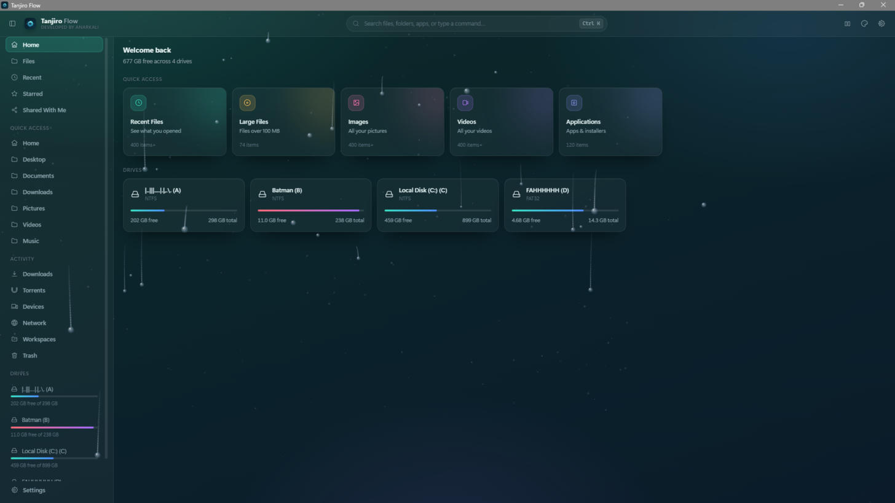
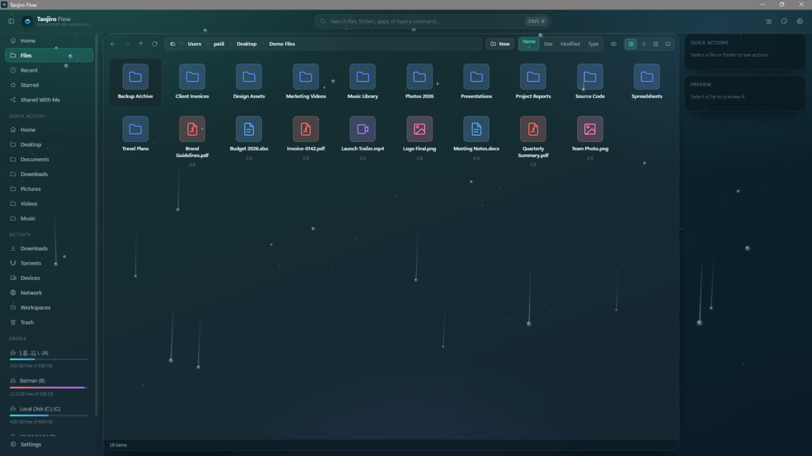
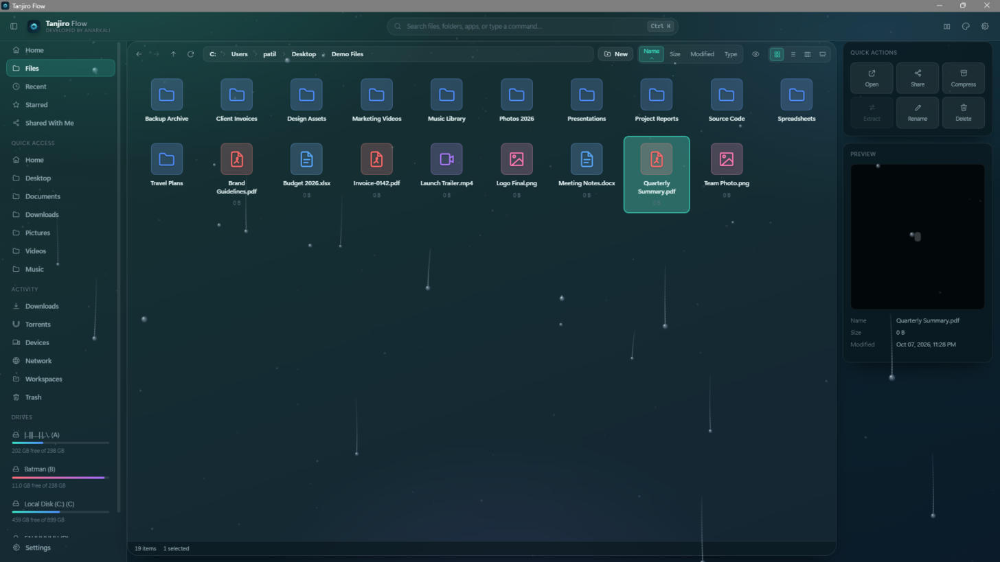
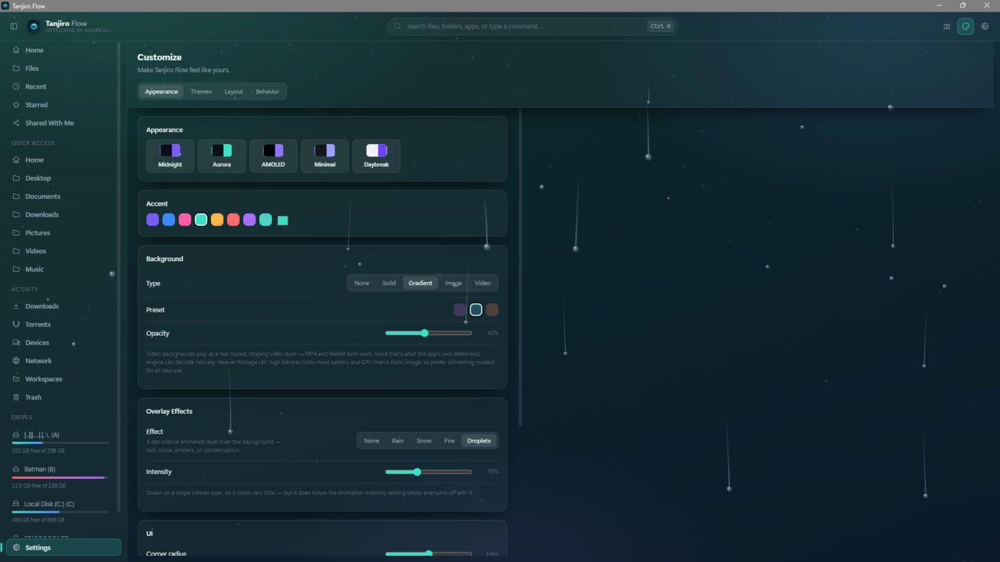
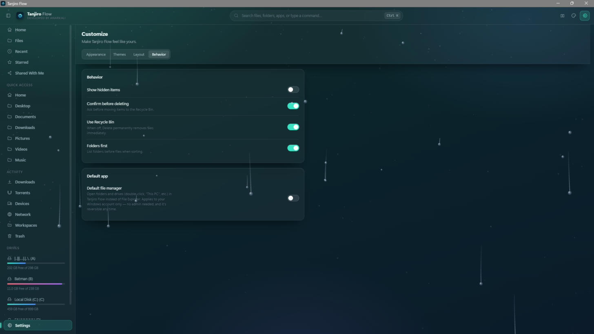

<div align="center">

# Tanjiro Flow

A fast, modern, dual-pane file manager for Windows — built with Tauri, React, and Rust.



</div>

## Features

- **Dual-pane browsing** with a full toolbar (back/forward/up, breadcrumbs, new folder, sort, hidden files, grid/list/column views)
- **Quick Access sidebar** — Home, Desktop, Documents, Downloads, Pictures, Videos, Music, plus Recent, Starred, and Shared With Me
- **Drive overview** with live free-space stats for every mounted drive
- **Quick Actions & Preview panel** — open, share, compress, extract, rename, delete, and a live file preview, right from the selection
- **Customizable appearance** — multiple themes (Midnight, Aurora, AMOLED, Minimal, Daybreak), accent colors, gradient/image/video backgrounds, and decorative overlay effects (rain, snow, fire, droplets)
- **Set as default file manager** — replace File Explorer for opening folders and drives, with one toggle (see below)

| Files view | Quick Actions & Preview |
|---|---|
|  |  |

| Appearance settings | Default file manager |
|---|---|
|  |  |

## Set Tanjiro Flow as your default file manager

Settings → Behavior → **Default file manager**.

Turning this on registers Tanjiro Flow (under `HKEY_CURRENT_USER`) to handle folder and drive opens — double-clicking a folder on the Desktop, launching via `Win+R`, "Open containing folder" from other apps, and similar. It's per-user, needs no admin rights, and is fully reversible by flipping the toggle back off.

**Known limitation:** double-clicking a folder *inside an already-open File Explorer window* still navigates within Explorer itself, because that uses Explorer's in-process "browse in place" navigation rather than launching a new shell window. This is standard behavior for any third-party file manager offering this feature, not a bug specific to Tanjiro Flow — the override reliably catches every *external* folder/drive open.

## Installing

Download the latest installer from the [Releases](../../releases) page and run it. No admin rights required.

## Building from source

Requirements: [Node.js](https://nodejs.org) 20.19+, [Rust](https://www.rust-lang.org/tools/install), and the [Tauri prerequisites](https://v2.tauri.app/start/prerequisites/) for Windows.

```bash
npm install
npm run tauri:build
```

The installer is produced under `src-tauri/target/release/bundle/nsis/`.

## Tech stack

- [Tauri v2](https://v2.tauri.app/) + Rust backend
- React 19 + TypeScript + Vite
- Zustand for state, Framer Motion for animation

## Platform support

Currently Windows only (NSIS installer).
